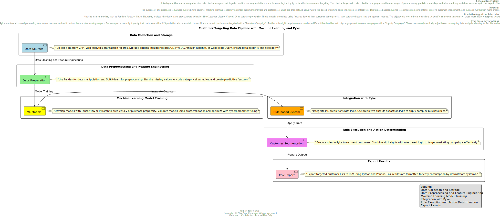

# Customer Targeting Data Pipeline

## 🚀 Exciting News from Our Tech Team!
Welcome to the Customer Targeting Data Pipeline, an advanced integration of Machine Learning (ML) and Pyke's rule-based logic designed to significantly enhance customer interactions and marketing strategies.

## 🔍 Project Overview
Our pipeline integrates robust data collection, advanced preprocessing, predictive modeling, and dynamic rule-based decision-making. This system is optimized to enhance marketing strategies and maximize ROI by targeting the right customers with the most effective campaigns.

## ✨ Purpose
This pipeline leverages ML to predict customer behaviors and refines these insights with Pyke's rule-based system to deliver personalized customer engagement strategies that are both effective and efficient.

## 🔧 Tech Highlights
Machine Learning: Using TensorFlow and PyTorch, we develop models that predict customer behaviors and value.
Pyke Integration: Flexible, rule-based logic adapts to dynamic market conditions and customer demographics.
Data Management: Ensures data integrity and scalability with solutions like PostgreSQL, MySQL, Amazon Redshift, and Google BigQuery.

## 🏗️ Architecture
Below is the architecture diagram of our data pipeline, showing the flow from data collection through to the application of business rules:



## 🐳 Docker Setup
### Prerequisites
Ensure Docker is installed on your system. If not, you can download it from Docker's official site.

### Clone the Repository
To get started, clone the repository to ensure you have all the necessary files for building the Docker image:

bash
```
git clone https://github.com/Mbaroudi/customer-targeting-data-pipeline.git
cd customer-targeting-data-pipeline
```
### Building the Docker Image
Build the Docker image using the following command:

bash
```
docker build -t customer-targeting-app .
```
This command builds a Docker image named customer-targeting-app based on the Dockerfile in the current directory.

### Running the Container
Run the container from the Docker image:

### Running the Container
To run the container and interact with the shell for executing scripts manually or checking outputs, use the following command:
bash
```
docker run -it --rm customer-targeting-app /bin/bash
```
Once inside the container, you can run the pipeline script:
bash
```
./run_pipeline.sh
```

This script processes data through your entire pipeline and saves the results to the specified output directory. It also prints the top 10 results to the console:

### Result
bash
```
customer_id,campaign_result
1,Young Prospects Offer
2,Young Prospects Offer
...
10,Young Prospects Offer
```

## 🌐 Getting Started
### Installation
Install the necessary Python packages:

bash
```
pip install -r requirements.txt
```
### Running Tests
Execute the automated tests:

bash
```
python -m unittest discover
```
###  Deployment Notes
Include additional notes on deploying this application in a live system here.

## 🔧 Built With
Python - The programming language used.
TensorFlow, PyTorch - For building machine learning models.
Pyke - For rule-based logic.
## 📝 Contributing
Please see CONTRIBUTING.md for our code of conduct and contribution guidelines.

## 👥 Authors
MALEK BAROUDI - Initial work - Mbaroudi
📜 License
This project is licensed under the Apache License 2.0 - see the LICENSE.md file for details.

## 💡 Acknowledgments
Hat tip to anyone whose code was used
Inspiration, etc.

